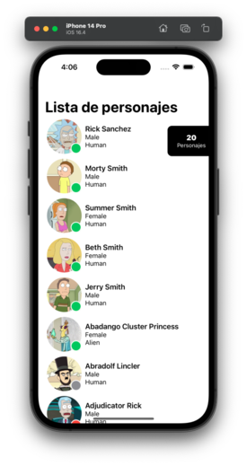

# Bienvenidos a SwiftUI

## Capítulo 2 | Practicando con datos

En este capítulo vamos a ponernos manos a la obra, vamos a realizar una lista de personajes de rick y morty utilizando la arquitectura MVVM clean. El objetivo es crear un diseño igual que el mostrado a continuación. Se provee un proyecto que tiene creadas gran parte de la lógica necesaria.

