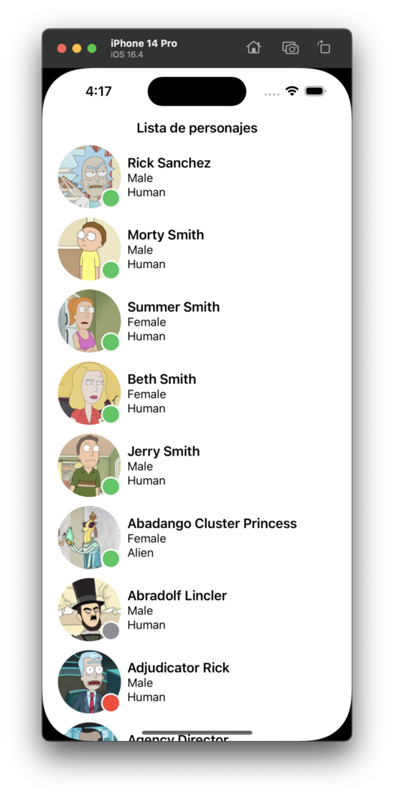
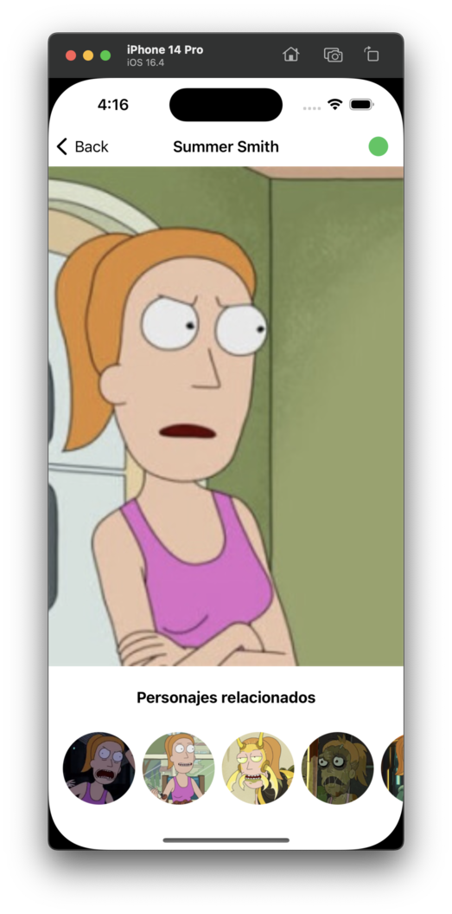

# Bienvenidos a SwiftUI

## Capítulo 3 | Navegación y detalle

En este capítulo ya tenemos una lista de personajes de rick y morty utilizando la arquitectura MVVM clean. Ahora vamos a crear un detalle y la navegación entre ellos.

El objetivo es crear un diseño igual que el mostrado a continuación. Se provee un proyecto que tiene creadas gran parte de la lógica necesaria.

